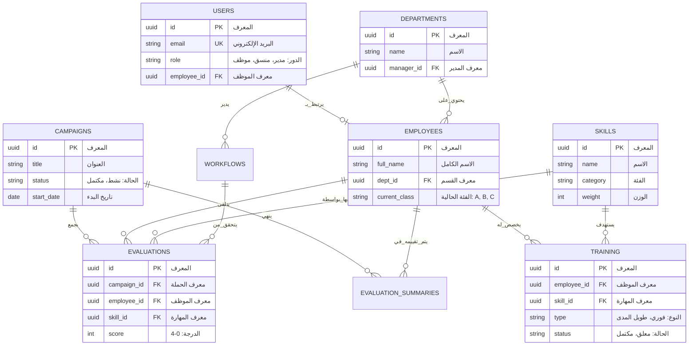
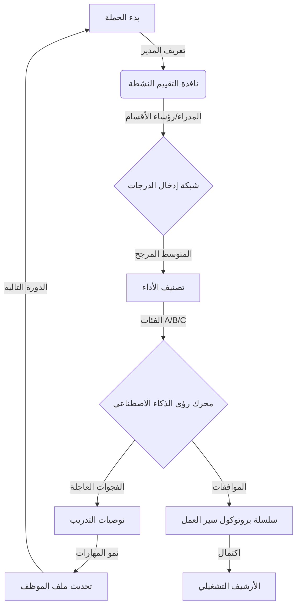
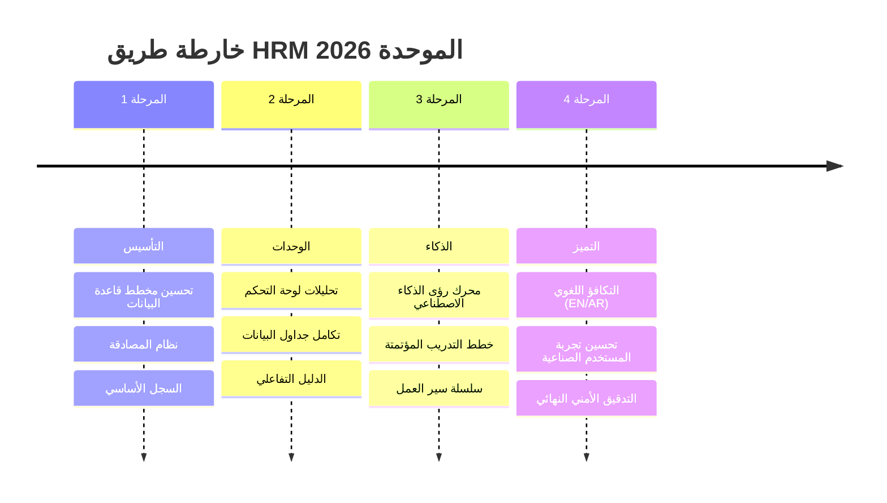

# منصة HRM الموحدة - الهندسة التقنية والاستراتيجية (AR)

## 1. مخطط علاقة الكيانات (ERD)
يوضح هذا المخطط هيكل البيانات الأساسي والعلاقات بين الموظفين والتقييمات وسير العمل التشغيلي.

## 2. التدفق التشغيلي للنظام
دورة "الذكاء الصناعي" من البداية حتى توصيات التدريب المؤتمتة.

## 3. خارطة الطريق للتنفيذ
الجدول الزمني لتسليم منصة HRM الموحدة.

