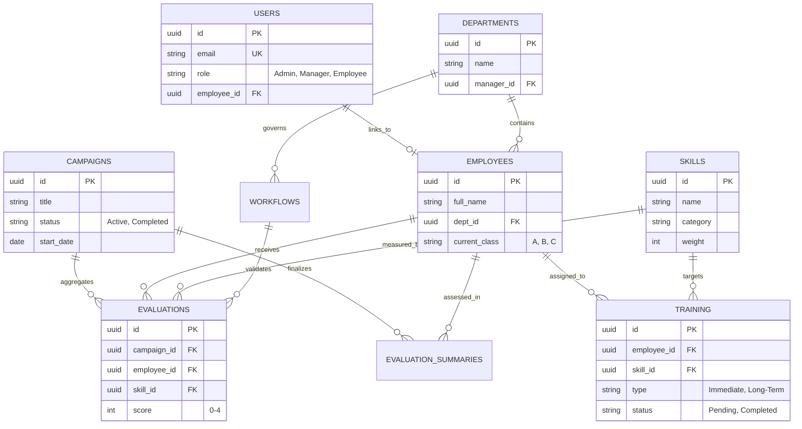
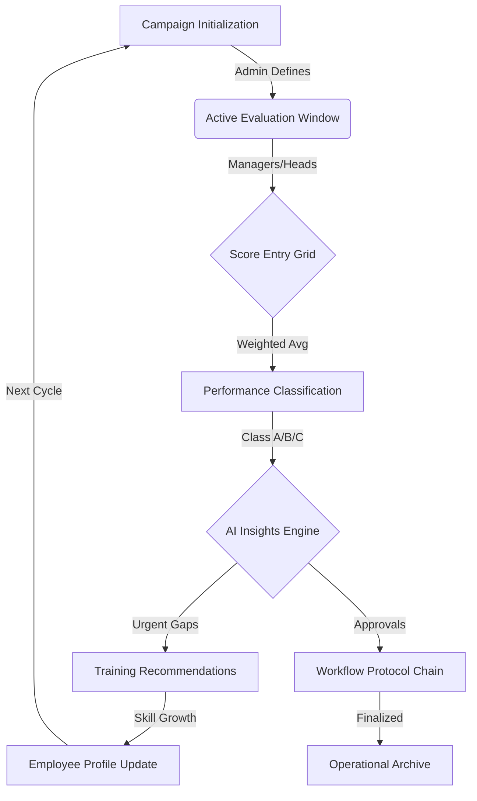
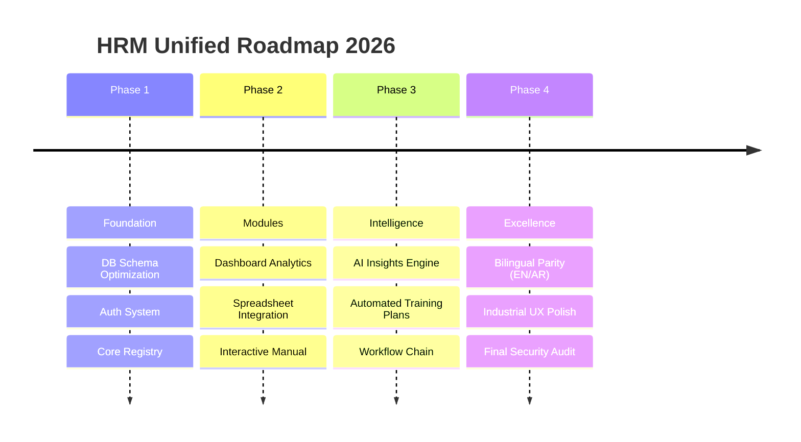

# HRM Unified Platform - Technical Architecture & Strategy (EN)

## 1. Entity Relationship Diagram (ERD)
This diagram illustrates the core data structure and relationships between personnel, evaluations, and operational workflows.

## 2. System Operational Flow
The "Industrial Intelligence" cycle from initialization to automated training recommendations.

## 3. Implementation Roadmap
Strategic delivery timeline for the HRM Unified Platform.

