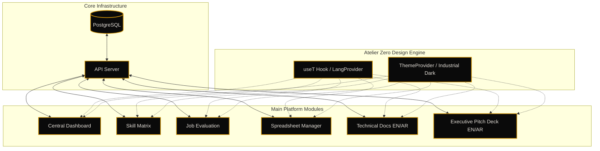

# HRM Skill Matrix System - Architecture & Flow

This diagram outlines the high-level architecture and data flow of the HRM Skill Matrix System within the Grand Line ERP ecosystem, highlighting the bilingual parity and unified design standards.

> [!IMPORTANT]
> **Atelier Zero Industrial Standard**: The platform strictly adheres to the "Dark Industrial-Luxury" theme. All modules utilize `#0A0A0A` backgrounds with `#D4960A` (Metallic Gold) accents. UI consistency is enforced via a shared `Layout` shell and centralized CSS variables.

## System Breakdown

### 1. Centralized Dashboard
The core hub for organizational telemetry. Provides real-time insights into employee performance classes (A/B/C) across 9 departments.

### 2. Skill Matrix & Job Evaluation
Twin modules for granular competency tracking and job-role alignment. Supports weighted scoring formulas and automated training gap identification.

### 3. Integrated Documentation & Pitch Deck
- **Docs**: A comprehensive technical manual (EN/AR) for both developers and HR administrators.
- **Pitch Deck**: A 16-slide high-fidelity presentation for stakeholder engagement, fully localized and theme-aware.

### 4. Bilingual Core (EN/AR)
The system achieves 100% parity between English and Arabic. RTL/LTR transitions are handled automatically via the `LangProvider`, ensuring a seamless user experience for all personnel.

### 5. Unified Navigation & Theme
The platform uses a conditional `Layout` shell that provides a global Sidebar, Topbar, and Theme Toggle, while allowing full-width flexibility for the presentation and documentation modules.
